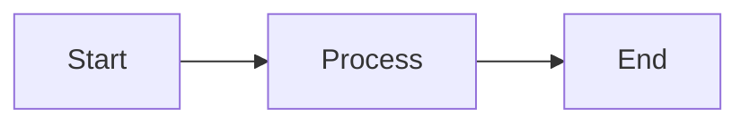

## Personal Site

Personal website and blog built with SvelteKit, based on the [Urara](https://github.com/importantimport/urara) template.

Visit at [https://www.saikumarmk.com](https://www.saikumarmk.com)


## Notable Components

This site features several custom interactive components beyond the standard blog template.

### Project Dex

A Pokedex-inspired project showcase at `/portfolio/projects`.

**Source:** `src/routes/portfolio/projects/+page.svelte`

**Features:**
- Grid of project squares with Pokemon sprites as icons
- Modal popup styled like a Pokedex entry with Pokemon Game Boy grid background
- Typing effect that displays description text character-by-character (30ms/char)
- Pagination system that splits long descriptions into 2-sentence pages
- Red bouncing arrow indicator for "more text" navigation
- Responsive design with different fonts for mobile (`pokemondppt`) vs desktop (`Press Start 2P`)

**How it works:**
```
1. Projects defined in src/lib/config/portfolio.ts
2. Each project has a Pokemon sprite (from pokesprite CSS classes)
3. On click, modal opens and triggers startTyping() animation
4. getDescriptionPages() splits text by sentences for pagination
5. Arrow appears when more pages available
```

### TechBadge Component

3D beveled technology badges inspired by Pokemon type badges.

**Source:** `src/lib/components/projects/TechBadge.svelte`

**Features:**
- 4x4 CSS grid creates beveled 3D illusion
- Dynamic color generation using `lighten()` and `darken()` functions
- Auto-scaling text based on badge name length
- Corner dots for decorative effect
- Shadow and highlight calculated from base colors

**Usage:**
```svelte
<TechBadge name="Python" colors={['#3776AB', '#FFD43B', '#3776AB', '#FFD43B']} />
```

Colors are mapped in `src/lib/config/tech-colors.ts`.

### Yggdrasil (Growth Tree)

Interactive skill tree visualization at `/growth/2026` for tracking learning goals.

**Source:**
- Main: `src/routes/growth/2026/+page.svelte`
- Graph: `src/routes/growth/2026/components/GrowthGraph2D.svelte`
- Layout: `src/routes/growth/2026/utils/elkLayout.ts`
- Data: `src/resources/growth2026.json`

**Features:**
- DAG layout using ELK.js for deterministic node positioning
- Canvas-rendered nodes with Pokemon Game Boy styling
- Branch color coding with Pokemon sprite mascots
- Tier system: Roots (foundations) -> Trunk (techniques) -> Branch (specializations) -> Crown (capstones)
- Status tracking: locked, available, in_progress, complete
- Filter panel for branches, tiers, and status
- Click-to-select with detail panel

**Node structure in JSON:**
```json
{
  "id": "node-id",
  "title": "Human Title",
  "branch": "systems-hpc",
  "tier": "trunk",
  "prerequisites": ["other-node"],
  "status": "available",
  "estimate_hours": 15
}
```

### Pokemon Sprite System

Site-wide Pokemon Game Boy aesthetic using sprite sheets.

**Source:**
- Sprites: `src/lib/components/pkmn/pokemon.svelte`
- Framed: `src/lib/components/pkmn/frame.svelte`
- CSS: `src/styles/pokesprite-pokemon-gen8.css`
- Data: `src/resources/pokemonClasses.json`

**Usage in markdown:**
```svelte
<script>
import PokemonSprite from '$lib/components/pkmn/pokemon.svelte'
</script>

<PokemonSprite pokemonName="pikachu" size="large" />
```

The CSS uses background-position to display individual Pokemon from a spritesheet.

### Search Modal

Ctrl+K triggered search with weighted scoring.

**Source:** `src/lib/components/search_modal.svelte`

**Features:**
- Searches posts AND static pages (About, Portfolio, Yggdrasil, etc.)
- Weighted scoring: title (100) > tags (50) > summary (30) > content (10)
- Arrow key navigation with auto-scroll
- ESC to close, Enter to navigate
- Highlights matched text

**Scoring algorithm:**
```js
if (title.includes(query)) score += 100;
if (tags.some(t => t.includes(query))) score += 50;
if (summary.includes(query)) score += 30;
if (content.includes(query)) score += 10;
```

Results sorted by score descending.

### LaTeX Math Rendering

Math expressions rendered via KaTeX through `rehype-katex-svelte`.

**Configuration:** `mdsvex.config.ts`

**Syntax:**
- Inline math: `$x + y$`
- Display math: `$$\nabla_\theta J(\theta) = ...$$`

**Custom macros defined:**
```js
macros: {
  "\\CC": "\\mathbb{C}",
  "\\vec": "\\mathbf",
}
```

**Important:** Do NOT use `\(` or `\[` delimiters - they are not supported in MDSvex. Always use `$` and `$$`.

### Mermaid Diagrams

Dynamic diagram rendering with theme-aware colors.

**Source:** `src/lib/components/prose/mermaid.svelte`

**Features:**
- Reads DaisyUI CSS variables for theme colors
- Converts HSL to hex for Mermaid compatibility
- Auto-rerenders on theme change via MutationObserver
- Unique IDs prevent conflicts with multiple diagrams

**Usage in markdown:**
````markdown

````

The component extracts `--b1`, `--p`, `--bc` CSS variables from DaisyUI and maps them to Mermaid's theme system.

### Python Code Annotator

Side-by-side documentation and code display, inspired by literate programming.

**Source:** `src/lib/components/prose/code.svelte`

**Features:**
- Fetches Python file from URL at runtime
- Parses docstrings and comments as documentation
- Renders docs as markdown (via `mdsvex_processor.js`)
- Syntax highlights code with highlight.js
- Two-column layout: docs left, code right
- Responsive: stacks vertically on mobile

**Usage:**
```svelte
<script>
import PythonCode from '$lib/components/prose/code.svelte'
</script>

<PythonCode 
  sourceUrl="/annotations/elo_calculator.py" 
  title="Elo Calculator" 
/>
```

**Python file format:**
```python
"""
## Section Title

Markdown documentation here.
"""

def my_function():
    """
    Function docstring becomes docs panel content.
    """
    code_here()  # This appears in code panel
```

The parser detects:
- Triple-quoted docstrings (`"""` or `'''`)
- Comment blocks starting with `#`
- Function/class definitions to create new sections


## Content Structure

`urara/*` contains all posts rendered via the standard route. Each post has a `+page.md` with frontmatter and content.

**Importing components in markdown:**
```js
<script>
import PokemonSprite from '$lib/components/pkmn/pokemon.svelte'
import Sprite from '$lib/components/pkmn/sprite.svelte'
import Framed from '$lib/components/pkmn/frame.svelte'
</script>
```

**Key files:**
- Home page: `src/routes/+page.svelte`
- Post container: `src/lib/components/post_container.svelte`
- Site config: `src/lib/config/site.ts`
- Portfolio data: `src/lib/config/portfolio.ts`


## Yggdrasil Commands

Growth pages live in `urara/growth/2026/` and get copied to `src/routes/` during dev/build.

### Creating a New Node

Run the interactive generator:

```bash
pnpm run growth:new
```

This will prompt for:
- Node title
- Node ID (kebab-case)
- Branch (systems-hpc, gen-video, rl-posttraining, math-foundations, swe-craft, physics, research)
- Tier (roots, trunk, branch, crown)
- Tags (comma-separated)
- Estimated hours

The script creates:
- `urara/growth/2026/<node-id>/+page.md` - The markdown page
- Updates `src/resources/growth2026.json` with the new node and edges

### Creating a Page for a Single Existing Node

If a node exists in `growth2026.json` but doesn't have a page yet:

```bash
pnpm run growth:page <node-id>
```

Example:
```bash
pnpm run growth:page distributed-training-mental-models
```

### Backfilling Pages for All Existing Nodes

To generate pages for ALL nodes in `growth2026.json` that don't have pages:

```bash
pnpm run growth:backfill
```

### File Structure

```
urara/growth/2026/
└── <node-id>/
    └── +page.md              # Node content (copied to src/routes/ on build)

src/routes/growth/2026/
├── +page.svelte              # Main graph visualization
├── types.ts                  # TypeScript types
├── components/               # Graph UI components (GrowthGraph2D, GrowthControls)
└── utils/                    # Graph helpers (elkLayout, nodeUtils, graphHelpers)

src/resources/
└── growth2026.json           # Node/edge data
```

### Node Page Format

```markdown
---
title: 'Node Title'
created: YYYY-MM-DD
updated: YYYY-MM-DD
tags: [yggdrasil, branch-name, other-tags]
growth:
  node_id: 'node-id'
  branch: 'branch-name'
  tier: 'roots|trunk|branch|crown'
  estimate_hours: 15
---

Content here...
```